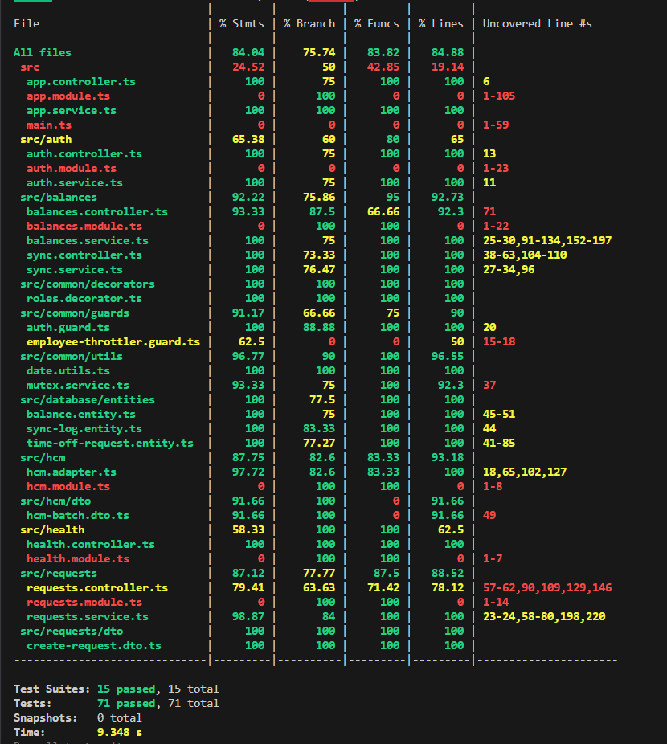

# TRD Outline — Time-Off Microservice

## 1. Overview
The **Time-Off Microservice** is a high-resilience system designed to manage the lifecycle of employee time-off requests. It serves as a sophisticated **Anti-Corruption Layer (ACL)** between internal enterprise applications and external **Human Capital Management (HCM)** systems (e.g., Workday, SAP). By providing a localized, performant cache of leave balances and enforcing strict business rules, the service ensures high availability even when upstream HCM systems are slow or unreachable.

### 1.1 Purpose & Scope
The primary purpose of this microservice is to decouple leave management business logic from the complexities of external vendor APIs. 
*   **Scope**:
    *   End-to-end management of the request lifecycle (Submission → Validation → Approval → Debit → Resolution).
    *   Real-time synchronization and defensive caching of employee leave balances.
    *   Large-scale batch ingestion of data updates pushed via HCM webhooks.
    *   Resilient rollback mechanisms for request cancellations within defined grace periods.

### 1.2 Service Ownership Boundary
This service owns the **Request State Machine** and the **Local Balance Cache**. 
*   **Authoritative Source**: The external HCM remains the ultimate source of truth for total available balances and payroll-impacting data.
*   **Persistence**: Uses a localized SQLite instance (WAL mode) optimized for single-process, high-concurrency read operations.
*   **Identity**: Consumes JWT identities issued by a central Identity Provider (IdP) but enforces internal Role-Based Access Control (RBAC).

### 1.3 Non-Goals
*   **Payroll Processing**: This service does not calculate pay rates or perform tax deductions.
*   **Attendance Tracking**: Clock-in/clock-out functionality and physical presence monitoring are out of scope.
*   **Direct HCM Management**: This service does not provide a UI for managing HCM configurations; it is purely a consumer of HCM data.
*   **Internal Notifications**: While it emits events (e.g., `request.created`), it does not own the delivery of emails or Slack messages (delegated to a separate Notification Service).

## 2. System Context
The system is designed as a standalone microservice that interfaces between client-facing platforms and high-latency enterprise HCM systems. It prioritizes data consistency and availability through a layered architecture.

### 2.1 Architecture Diagram
The following diagram illustrates the high-level flow of data and the separation of concerns within the service:

### 2.2 Component Responsibilities

| Component | Responsibility | Key Attributes |
| :--- | :--- | :--- |
| **Controllers** | API Entry points. Responsible for request parsing, response formatting, and Swagger documentation. | RESTful, Stateless |
| **Business Services** | Core domain logic. Orchestrates the request lifecycle, manages balance calculations, and enforces business rules. | Transactional, Synchronous |
| **HCM Adapter** | The **Anti-Corruption Layer (ACL)**. Normalizes external vendor responses and handles outbound communication timeouts/retries. | Resilient, Decoupled |
| **Local Cache** | High-performance persistence layer for balances and requests. Reduces dependency on external system uptime. | SQLite (WAL Mode), Low Latency |
| **Auth & Guards** | Enforces identity verification (JWT) and behavioral constraints (Throttling/RBAC). | Security-First |
| **Event Bus** | Asynchronous communication within the service and integration hooks for downstream observability. | decoupled, `EventEmitter2` |

## 3. Data Model
The data model is optimized for the **Cache-Aside** pattern, ensuring that every record can be traced back to an HCM version or synchronization event.

### 3.1 Table: `balance`
Acts as the localized cache for employee leave entitlements.
*   **Columns**:
    *   `id` (UUID): Primary key.
    *   `employeeId` (String): Indexed for fast lookup.
    *   `locationId` (String): To handle multi-site employees.
    *   `leaveType` (Enum): `annual`, `sick`.
    *   `balance` (Decimal): The cached numerical value.
    *   `hcmVersion` (Integer): The version identifier from the external system.
    *   `lastSyncedAt` (Timestamp): Used to determine staleness.

### 3.2 Table: `time_off_request`
Manages the lifecycle and audit trail of individual leave applications.
*   **Columns**: `id`, `employeeId`, `locationId`, `leaveType`, `startDate`, `endDate`, `days` (calculated), `status`, `managerId`, `note`, `requestedAt`, `resolvedAt`.

#### Status State Machine
The request lifecycle is strictly enforced via the following transition logic:

### 3.3 Table: `sync_log`
Provides a high-fidelity audit trail for all synchronization operations.
*   **Columns**:
    *   `type` (Enum): `ON_DEMAND` (per user), `BATCH` (webhook).
    *   `triggeredBy` (String): User ID or system source.
    *   `status` (Enum): `SUCCESS`, `FAILURE`.
    *   `detail` (JSON): Stores metadata like processed records, error messages, or drift values.

### 3.4 Key Design Decisions
1.  **SQLite (WAL Mode)**: Chosen for its zero-latency local access and serverless simplicity. WAL mode ensures that read-heavy operations (balance checks) are never blocked by background synchronization tasks.
2.  **Explicit Versioning**: The `hcmVersion` field is critical for idempotent updates. It prevents out-of-order webhook deliveries from overwriting newer local data with older HCM snapshots.
3.  **Audit over Overwrite**: In the event of a batch sync conflict (e.g., balance changes while a request is PENDING), the system flags the request rather than silently updating the balance, ensuring managers are aware of potential data drift.

## 4. Core Challenges
Managing time-off data between a microservice and an external HCM involves several distributed systems challenges:

### 4.1 Balance Drift (HCM-initiated updates)
Balances can change in the HCM due to manual HR adjustments, payroll cycles, or tenure-based accruals without notifying our service. Relying solely on a static cache leads to "ghost balance" errors.

### 4.2 Unreliable HCM Error Reporting
HCM APIs may return a successful status code (`200 OK`) but fail to provide the updated state (e.g., empty response body), or they may timeout after a debit has already been initiated on their side.

### 4.3 Atomicity of Debit + Local State Update
The system must ensure that a request is only marked as `APPROVED` if the HCM debit succeeded, and conversely, that a successful HCM debit always results in a local record update.

### 4.4 Concurrent Approvals Against Same Balance
If two managers approve different requests for the same employee simultaneously, they might both see the same "sufficient" balance before either debit is committed, leading to an over-withdrawal.

### 4.5 Batch Ingest Conflicting with Pending Requests
A large webhook update might change a balance to a value lower than what is required for a `PENDING` request that was submitted minutes prior.

---

## 5. Suggested Solutions

### 5.1 Dual-Layer Sync Strategy
To combat balance drift, the system implements two layers of synchronization:
1.  **Lazy Sync (Staleness-based)**: Every `GET /balances` call checks the `lastSyncedAt` timestamp. If it exceeds the threshold (default: 5 mins), a background sync is triggered.
2.  **Forced Sync (Transaction-based)**: Every approval/cancellation **forces** a real-time fetch from the HCM authoritative source before any state changes are allowed.

### 5.2 Defense in Depth (Unreliable HCM)
The `HcmAdapter` implements **Defensive Silence Handling**. If the HCM returns success but omits balance details, the service automatically waits for a jittered period (2s) and re-fetches the balance to confirm the operation's outcome before updating the local cache.

### 5.3 Compensating Transactions (Saga Pattern)
For approved requests cancelled within the 24-hour grace window, the service executes a compensating transaction (Credit) back to the HCM. This ensures the employee's entitlement is restored even after a successful debit, maintaining eventual consistency.

### 5.4 Striped Mutex (Concurrency Control)
To solve the "concurrent approval" problem without the overhead of distributed locks (like Redis), the service uses an **in-memory striped mutex** keyed by `employeeId`. This serializes all balance-impacting operations for a single employee while allowing high concurrency across the rest of the workforce.

### 5.5 Pending-Aware Webhook Ingestion
When a batch update arrives via webhook:
1.  It compares the new balance with the local cache.
2.  If there's a difference **and** there are `PENDING` requests for that employee, the system **flags** the requests (`pendingConflict: true`) and logs the event, alerting managers to the discrepancy rather than blindly overwriting the cache.

## 6. Alternatives Considered
Several alternative patterns were evaluated to address the core challenges of consistency and concurrency.

### 6.1 Design Trade-off Analysis

| Challenge | Alternative Considered | Rationale for Rejection |
| :--- | :--- | :--- |
| **Concurrency** | **Distributed Locking (Redis/Redlock)** | Excessive operational complexity for the current scale. Adding a Redis dependency would increase infrastructure overhead without providing immediate value for a single-node microservice. |
| **Consistency** | **Two-Phase Commit (2PC)** | HCM vendor APIs do not support prepared transactions. Attempting to force a 2PC would lead to long-held locks and high failure rates in a distributed environment. |
| **Balance Sync** | **Real-time only (No Cache)** | Significant performance degradation. Fetching from HCM on every `GET` would result in high latency and make the system unusable during HCM maintenance windows or outages. |
| **Persistence** | **PostgreSQL** | Over-provisioned for a specialized microservice. SQLite provides the necessary ACID guarantees with significantly lower footprint and easier deployment in edge/containerized environments. |
| **Event Handling** | **Message Queue (RabbitMQ/Kafka)** | Introduced premature scaling complexity. `EventEmitter2` provides sufficient in-process decoupling for the current notification and logging requirements. |

### 6.2 Decision Rationale
The current architecture prioritizes **operational simplicity** and **availability**. By choosing a "Cache-Aside with forced sync on write" approach, we achieve a balance where the system is performant for reads while remaining authoritative for critical writes, all without the maintenance burden of a distributed infrastructure stack.

## 7. API Specification
The service exposes a secure REST API for both internal administrative tools and external HCM webhook integration.

### 7.1 Primary Endpoints

| Method | Path | Auth | Responsibility |
| :--- | :--- | :--- | :--- |
| **POST** | `/auth/login` | None | Exchange credentials for a role-based JWT. |
| **GET** | `/balances` | `employee` | Retrieve current leave balances (Cache-Aside). |
| **POST** | `/requests` | `employee` | Submit a new time-off request (Pre-check logic). |
| **GET** | `/requests` | `manager` | List all requests filtered by status/employee. |
| **PATCH** | `/requests/{id}/approve` | `manager` | Execute real-time HCM debit and transition to APPROVED. |
| **PATCH** | `/requests/{id}/reject` | `manager` | Transition request to REJECTED. |
| **POST** | `/requests/{id}/cancel` | `employee` | Transition to CANCELLED (Rollback if within 24h). |
| **POST** | `/hcm/batch` | `hcm_system` | Process bulk balance updates (Webhook ingestion). |
| **GET** | `/health` | None | Liveness and readiness probe for orchestration. |

### 7.2 HCM Adapter Interface
The `HcmAdapter` defines the contract for external communication. It abstracts the following operations:
*   `getBalance(empId, locId)`: Retrieves authoritative balance from HCM.
*   `debitBalance(empId, locId, type, days)`: Atomic debit attempt.
*   `creditBalance(empId, locId, type, days)`: Atomic credit/rollback attempt.

**Retry & Timeout Policy**:
*   **Timeout**: 5,000ms mandatory abort for all HCM calls.
*   **Error Normalization**: Non-retryable errors (e.g., 422 Insufficient Balance) are bubbled up as `BadRequestException`. Network/Transient errors are logged and reported as `ServiceUnavailableException`.

## 8. Test Strategy
The service employs a multi-dimensional testing strategy designed to ensure reliability in the face of unreliable external dependencies and concurrent user behavior.

### 8.1 Testing Layers
1.  **Unit Tests (Jest)**: Target individual domain functions, such as business day calculation, DTO validation, and cache staleness logic.
2.  **E2E / Integration Tests (Supertest)**: Exercises complete API flows (e.g., Login → Submission → Approval). These tests run against a live application instance using a separate test database.
3.  **Adversarial Tests**: Specialized integration tests that simulate external failures, including HCM timeouts, network partitions, and race conditions.

### 8.2 Mock HCM Design
To ensure deterministic testing, the service utilizes a standalone **Mock HCM Server** (Node.js/Express). 
*   **Auto-Seeding**: Dynamically generates balances for unknown employees to allow rapid testing.
*   **Behavioral Config**: Supports runtime configuration via `/_config` to simulate:
    *   `unreliable`: Randomly returns successful status codes but fails to update internal state.
    *   `hang`: Intentionally hangs for > 5s to trigger service timeouts.

### 8.3 Coverage Requirements
*   **Global Coverage**: Minimum **85%** total line coverage.
*   **Critical Path Coverage**: **100%** coverage for the `RequestsService` approval and cancellation logic, ensuring all compensating transactions are verified.

### 8.4 Key Adversarial Scenarios
| Scenario | Behavior Verified |
| :--- | :--- |
| **HCM Timeout** | Ensure the service aborts after 5s and preserves the request in a retryable state. |
| **Race Condition** | Two simultaneous approvals against a balance of 1. Ensure only one succeeds and the other receives a 400 error. |
| **HCM Silence** | HCM returns 200 but no balance update. Ensure our service re-fetches to verify state before updating cache. |
| **Drift Conflict** | A batch update reduces balance below a PENDING request amount. Ensure the request is flagged with `pendingConflict: true`. |

## 9. Scalability & Limitations
While optimized for resilience and performance in its current form, the service has specific architectural boundaries that must be considered for future growth.

### 9.1 SQLite Single-Process Constraint
The current use of SQLite (even in WAL mode) is optimized for single-instance deployments.
*   **Limitation**: Scaling the service horizontally (multiple pods/instances) would lead to database lock contention and split-brain scenarios regarding the local cache.
*   **Impact**: Horizontal scaling is currently not supported without architectural modification.

### 9.2 Scale-out Path
To transition this service to a globally scalable, high-availability cluster, the following migrations are required:
1.  **Database**: Migrate from SQLite to a managed **PostgreSQL** or CockroachDB cluster.
2.  **Distributed Locking**: Replace the in-memory striped mutex with a **Redis-based Redlock** mechanism to ensure concurrency control across multiple service nodes.
3.  **Caching**: Transition the local entity cache to a distributed cache (e.g., Redis) to ensure consistency across all pods.

### 9.3 HCM Rate Limit Handling
External HCM systems typically impose strict rate limits on their REST APIs.
*   **Current Handling**: The service uses a global throttler to protect itself from bursts, but outbound calls to HCM are currently synchronous.
*   **Future Improvement**: Implementing an outbound request queue with a **Token Bucket** algorithm would allow the service to "smooth out" bursts of approval requests, preventing 429 errors from the HCM vendor.

## 10. Assumptions & Open Questions

### 10.1 Key Assumptions
*   **Identity Consistency**: We assume that the `employeeId` and `locationId` provided in the JWT token are exactly matched with the keys used in the external HCM system.
*   **HCM Availability**: While we have a cache for reads, we assume that the HCM will be available for writes (approvals) with at least 99% uptime during business hours.
*   **Network Stability**: We assume that the latency between the Microservice and the HCM is generally under 200ms, allowing for our 5s timeout to be a conservative boundary.

### 10.2 Open Questions
*   **Data Retention**: How long should we keep `SyncLog` and `TimeOffRequest` records in the local database before archiving them to a long-term data warehouse?
*   **Notification Responsibility**: Should the microservice eventually take on the responsibility of sending the final email/Slack notification to the employee, or should it remain strictly an event emitter?
*   **Complex Leave Rules**: How should the system handle leave types that have complex calculation logic (e.g., "accrue 1.5 days per month of service") which may be easier to calculate locally than to re-fetch on every sync?